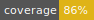

# @superflag/client-react



Superflag is an extensible feature flag library designed to support multiple
tiers of feature flag infrastructure, from a simple constant to staged rollouts.
It is designed to support multiple flag backends via an extensible plugin-style
architecture that allows for easy upgrades to different flag systems with
little to no maintenance overhead.

## Installation

The base Superflag package includes multiple default flag source plugins and
includes support for Typescript out of the box.

```shell
npm i @superflag/client-react
```

## [API Reference](https://superflag-io.github.io/superflag-client-react/)

## Usage Overview

### Configure Flag Sources (required)

The flag provider uses a basic
[React Context](https://reactjs.org/docs/context.html) to pass down the
fetched flag values to either the hooks or default components. In order for
the other utilities in the package to function properly, one must configure
the Flag Provider to wrap any code that depends on it (probably best at the
root level of the project).

The `FeatureFlagProvider` helper component simplifies the process of setting up
feature flags to a single component. Here's an example App with the flag
provider configured with a constant value flag source:

```jsx
// ...
import { FeatureFlagProvider } from '@superflag/client-react';
import { createConstantFlagSource } from '@superflag/client-react/defaultSources/constant';

const App = () => {
  // ...

  return (
    <IntlProvider>
      <FeatureFlagProvider
        flagSource={createConstantFlagSource({
          useV2ui: false,
          useNewPaymentGateway: true,
        })}>
        <div>
          <Header />
          <Content />
          <Footer />
        </div>
      </FeatureFlagProvider>
    </IntlProvider>
  );
};
```

#### Extra flexibility

In the unlikely event that you need more flexibility, you can separate
the provider and context declaration for even more extensibility via a
combination of `useFeatureFeatureFlagProvider` and `FeatureFlagProviderRaw`.
Here's the same example but with the calls split out:

```jsx
// ...
import {
  FeatureFlagProviderRaw,
  useFeatureFlagProvider,
} from '@superflag/client-react';
import { createConstantFlagSource } from '@superflag/client-react/defaultSources/constant';

const App = () => {
  const flagContext = useFeatureFlagProvider({
    flagSource: createConstantFlagSource({
      useV2ui: false,
      useNewPaymentGateway: true,
    }),
  });

  // ...

  return (
    <IntlProvider>
      <FeatureFlagProviderRaw {...flagContext}>
        <div>
          <Header />
          <Content />
          <Footer />
        </div>
      </FeatureFlagProviderRaw>
    </IntlProvider>
  );
};
```

### Consuming flags

There are multiple hooks and convenience components available. Both
can be used together if desired, the convenience components just reduce the
amount of identical code by handling common use cases (hiding/showing a
component based on a flag).

Hooks:

- `useFeatureFlagContext()` - returns the entire flag context, including
  loading, the flags, and the identify function
- `useFeatureFlags()` - returns all feature flags in key-value form
- `useFeatureFlag(flagKey)` - returns a single flag value

Components:

- `<FeatureFlagGate flagKey={...}>` - Hides its children if the flag is false,
  shows the children if the flag is true
- `<FeatureFlagSwitch whenTrue={...} whenFalse={...}>` - shows the passed
  value of whenFalse if the flag is false, shows the passed value of whenTrue if
  the flag is true. Both props are optional

Here's an example where everything is used:

```typescript jsx
import {
  useFeatureFlagContext,
  useFeatureFlags,
  useFeatureFlag,
  FeatureFlagGate,
  FeatureFlagSwitch,
} from '@superflag/client-react';

const ShoppingCart = () => {
  // option 1
  const { loading, flags } = useFeatureFlagContext();
  // option 2
  const { useV2ui } = useFeatureFlags();
  // option 3
  const useNewPaymentGateway = useFeatureFlag('useNewPaymentGateway');

  // apollo GQL mutation function
  const [checkout] = useMutation(endpoints.checkout);

  return (
    <div>
      {loading && <LoadingSpinner />}
      {/* option 1 */}
      <h1>{useV2ui ? 'Cart' : 'New and Improved Cart'}</h1>
      {/* option 2 */}
      <FeatureFlagGate flagKey="useV2ui">
        <input name="v2-input" />
      </FeatureFlagGate>
      {/* option 3*/}
      <FeatureFlagSwitch
        flagKey="useV2ui"
        whenTrue={<textarea name="v2-textarea" />}
        whenFalse={<select name="v1-select" />}
      />

      <button
        onClick={() => {
          checkout({ variables: { price: useNewPaymentGateway ? 1.5 : 2.5 } });
        }}>
        Checkout
      </button>
    </div>
  );
};
```

## Testing

Superflag supports mocking flags for testing purposes in one of two ways:

- For unit tests, `MockFeatureFlagProvider` can be used to mock the feature
  flag values
- For integration/e2e testing (live), one can swap out the `flagSource` when in
  different environments. For example, one could switch a LaunchDarkly flag
  source out for a constant flag source in testing/development environments

## Bugs & Contributions

Please report any bugs to the Github issue tracker for this project. Any
bug reports or PR submissions are appreciated!
